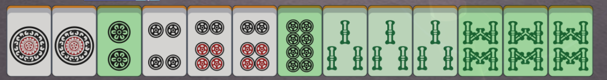
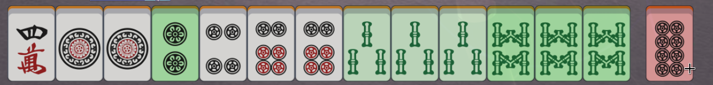
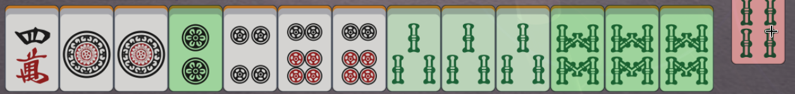

# Majya!

当有他家立直时，红色牌为现物，绿色牌由深到浅安全度逐渐降低。

# Preview






# Build

```bash
npm install
npm run build   # target script in ./build
```

# Usage

将`main.js`添加到`tampermonkey`新用户脚本。

# TODO

- [ ] 将杠牌翻的dora计入总牌数
- [X] 多家立直取安全牌的交集
- [ ] 断线重连重新获得之前状态
- [ ] 防守有明显听牌迹象的副露家
- [ ] 修复视觉效果